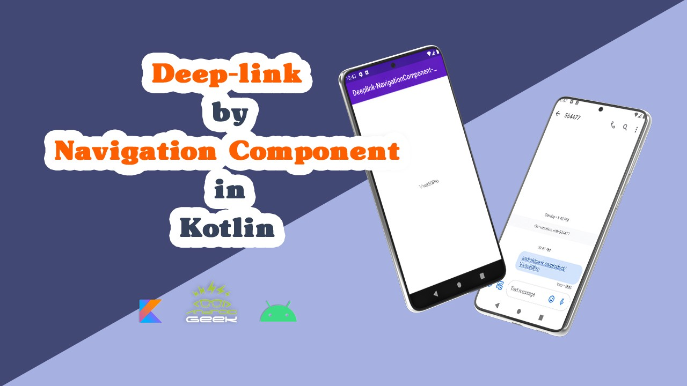

# Deeplink-NavigationComponent-Youtube
</a>

YouTube Video :
   

 

Medium's Article :
 
https://medium.com/@ezatpanah/use-deep-link-via-navigation-component-in-kotlin-d041fc705772

✨ Join Medium to read thousands of valuable stories ✨
 
https://medium.com/@ezatpanah/membership

